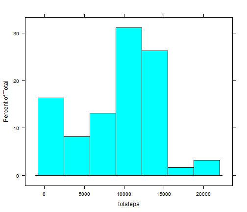
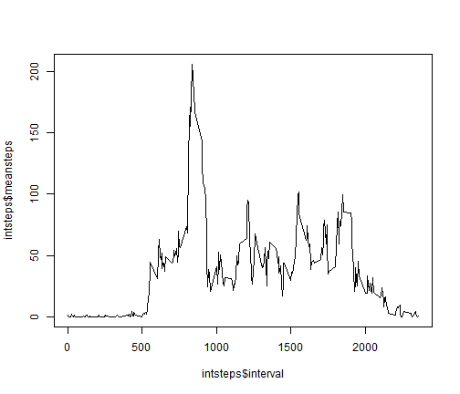
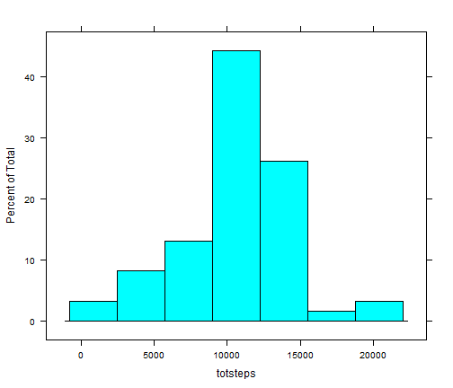
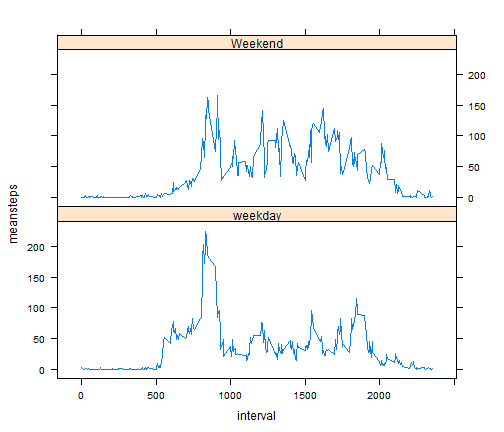

Repro Research Project 1
========================================================
What is mean total number of steps taken per day?

For this part of the assignment, you can ignore the missing values in the dataset.

Make a histogram of the total number of steps taken each day

Calculate and report the mean and median total number of steps taken per day


```r
#load libraries
library(stats)
library(lattice)
library(plyr)

#load data and process dates a little

d<-read.csv("activity.csv")
d$date1<-as.Date(d$date)
d$day<-weekdays(as.Date(d$date))
d$days<-as.factor(d$day)

#What is mean total number of steps taken per day?
#use plyr

stday<-ddply(d,"date",summarize,sum(steps,na.rm=TRUE))
names(stday)<-c("date","totsteps")

mean(stday$totsteps)
```

```
## [1] 9354
```

```r
median(stday$totsteps)
```

```
## [1] 10395
```

PLOT HISTOGRAM


```r
histogram(~totsteps, data=stday)
```

 

What is the average daily activity pattern?
================================================
Make a time series plot (i.e. type = "l") of the 5-minute interval (x-axis) and the average number of steps taken, averaged across all days (y-axis)

Which 5-minute interval, on average across all the days in the dataset, contains the maximum number of steps?


```r
#What is the average daily activity pattern?
intsteps<-ddply(d,"interval",summarize,mean(steps,na.rm=TRUE))
names(intsteps)<-c("interval","meansteps")


#what is the interval that has the maximum number of steps
which.max(intsteps$meansteps)
```

```
## [1] 104
```
TIME SERIES PLOT


```r
plot(intsteps$interval,intsteps$meansteps,type="l")
```

 

Imputing missing values
====================================================
Note that there are a number of days/intervals where there are missing values (coded as NA). The presence of missing days may introduce bias into some calculations or summaries of the data.

Calculate and report the total number of missing values in the dataset (i.e. the total number of rows with NAs)

Devise a strategy for filling in all of the missing values in the dataset. The strategy does not need to be sophisticated. For example, you could use the mean/median for that day, or the mean for that 5-minute interval, etc.

Create a new dataset that is equal to the original dataset but with the missing data filled in.

Make a histogram of the total number of steps taken each day and Calculate and report the mean and median total number of steps taken per day. Do these values differ from the estimates from the first part of the assignment? What is the impact of imputing missing data on the estimates of the total daily number of steps?


```r
#Imputing missing values
y<-na.omit(d)

# the difference in length gives the number of rows with NA
length(d$steps)-length(y$steps)
```

```
## [1] 2304
```

```r
#make copy of dataset call it zz
zz<-d

#create a loop to find which values indices have NA
# is have already created a data set with mean values
#at each interval so use a little modular arithmetic
#to find which interval corresponds to which index
#then plug in the mean for that interval instead of the NA

for (i in 1:length(zz$steps)){
  if (is.na(zz$steps[i])){
    n<-zz$interval[i]
    n1<-n%/%100
    nrem<-n-n1*100
    nimpt<-n1*12+nrem%%12+1
    zz$steps[i]<-intsteps$meansteps[nimpt]
  }
}

#now let's see how this imputation affects things
#use plyr again to sum steps across date
#place that into a new data set stday1

stday1<-ddply(zz,"date",summarize,sum(steps))
names(stday1)<-c("date","totsteps")

#now calculate mean and median

mean(stday1$totsteps)
```

```
## [1] 10766
```

```r
median(stday1$totsteps)
```

```
## [1] 10766
```

Plot a new Histogram using the imputed values

```r
histogram(~totsteps, data=stday1)
```

 
There are some subtle differences in mean median and histogram. For elusive reasons the mean and median are not calculate correctly here but they are when I run them in r
================================================

Are there differences in activity patterns between weekdays and weekends?
==================================================

For this part the weekdays() function may be of some help here. Use the dataset with the filled-in missing values for this part.

Create a new factor variable in the dataset with two levels – “weekday” and “weekend” indicating whether a given date is a weekday or weekend day.

Make a panel plot containing a time series plot (i.e. type = "l") of the 5-minute interval (x-axis) and the average number of steps taken, averaged across all weekday days or weekend days (y-axis). The plot should look something like the following, which was creating using simulated data:


```r
#Are there differences in activity patterns between weekdays and weekends?
#I already used the weekdays function above
#Now do a loop that calls days with saturday and sunday #weekends and other days weekdays

for (i in 1:length(zz$steps)){
 if (zz$day[i]=="Saturday"|zz$day[i]=="Sunday")
 {zz$type[i]="Weekend"}
 else {zz$type[i]="weekday"}
  
}
#convert that to a factor

zz$type<-as.factor(zz$type)

#use ddply once more to take means accross intervals for #each type

intstepstype<-ddply(zz,c("interval","type"),summarize,mean(steps))
names(intstepstype)<-c("interval","type","meansteps")
```

Plot this


```r
with(intstepstype,xyplot(meansteps~interval|type,layout=c(1,2),type="l"))
```

 
